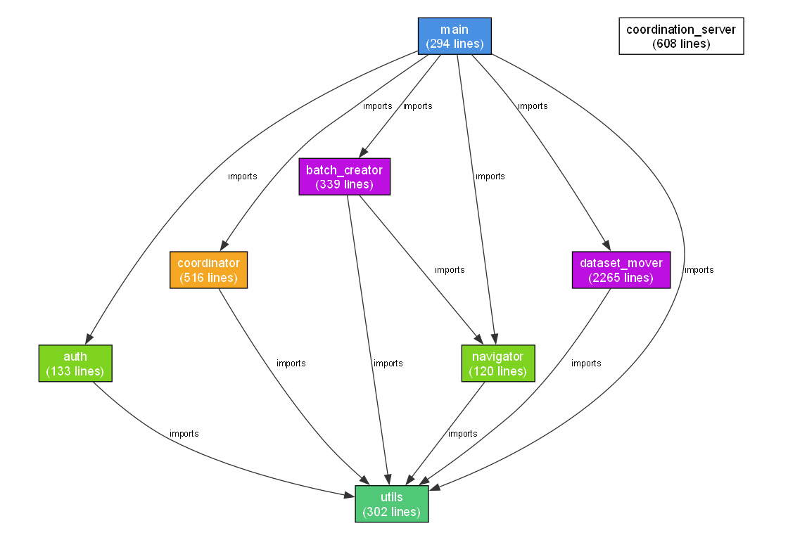

# Roboflow Annotation Batch Automation

> Automate the full lifecycle of annotation job management on [Roboflow](https://roboflow.com) — from assigning unassigned images to labellers, to converting annotated jobs and moving them into the dataset — all through browser automation with multi-machine coordination.


---

## Table of Contents

- [Overview](#overview)
- [Demo](#demo)
- [Architecture](#architecture)
- [Features](#features)
- [Prerequisites](#prerequisites)
- [Installation](#installation)
- [Configuration](#configuration)
- [Usage](#usage)
  - [Single Machine](#single-machine)
  - [Two-Machine Setup](#two-machine-setup)
- [How It Works](#how-it-works)
  - [Phase 1 — Batch Assignment](#phase-1--batch-assignment)
  - [Phase 2 — Move to Dataset](#phase-2--move-to-dataset)
- [Collection Tiers](#collection-tiers)
- [Coordination System](#coordination-system)
- [Remote Monitoring Dashboard](#remote-monitoring-dashboard)
- [Project Structure](#project-structure)
- [Troubleshooting](#troubleshooting)

---

## Overview

When managing large-scale annotation projects on Roboflow (thousands of jobs, hundreds of thousands of images), manual processing becomes impractical. This tool automates two critical phases:

| Phase | What it does | Speed |
|-------|-------------|-------|
| **Phase 1** | Selects unassigned images → assigns them to labellers in batches | ~2,000 images/minute |
| **Phase 2** | Processes annotating jobs → converts unannotated images to null → adds to dataset | 10 jobs in parallel |

The system supports **multi-machine deployment** — run two laptops simultaneously with opposite collection strategies (top-down and bottom-up) for maximum throughput, coordinated through a central HTTP server.

---

## Demo

### Phase 1 — Batch Assignment Demo

[](https://youtu.be/v6QeOOFJtqs)

> Click the image above to watch the Phase 1 demo on YouTube.

### Phase 2 — Move to Dataset Demo

[](https://youtu.be/X4grrCbCrqk)

> Click the image above to watch the Phase 2 demo on YouTube.

---

## Architecture

### High-Level Module Diagram



For an **interactive version**, open [module_architecture.html](module_architecture.html) in your browser. It includes:
- 📊 Detailed module inventory
- 🔗 Dependency matrix
- 📈 Data flow diagrams
- 🔍 Key insights and statistics

For detailed module documentation, see:
- [ARCHITECTURE.txt](ARCHITECTURE.txt) — ASCII art diagram with full connection breakdown
- [MODULE_BREAKDOWN.txt](MODULE_BREAKDOWN.txt) — Detailed module inventory
- [module_architecture.mmd](module_architecture.mmd) — Mermaid source (editable)
- [module_architecture.json](module_architecture.json) — Structured data export

### Execution Flow

```
┌──────────────────────────────────────────────────────────────────┐
│                        main.py (Entry Point)                     │
│     Auth → Navigate → Phase 1 (Batch Creator) → Phase 2 (Mover) │
└──────────┬────────────────────────┬──────────────────────────────┘
           │                        │
   ┌───────▼───────┐    ┌──────────▼──────────┐
   │ batch_creator  │    │   dataset_mover      │
   │ (Phase 1)      │    │   (Phase 2)          │
   │                │    │                      │
   │ Select images  │    │ Tier 0: JS intercept │
   │ Assign batches │    │ Tier 1: React Fiber  │
   │ Round-robin    │    │ Tier 2: Click cards  │
   └───────────────┘    │                      │
                        │ Pipeline: N parallel  │
                        │ tab state machines    │
                        └──────────┬───────────┘
                                   │
           ┌───────────────────────▼────────────────────────┐
           │         coordination_server.py (Flask)          │
           │                                                 │
           │  /claim, /done, /failed  — URL coordination     │
           │  /heartbeat, /workers    — Worker monitoring     │
           │  /logs, /log-stream      — Real-time SSE logs    │
           │  /code/manifest, /file   — Live code push        │
           │  /dashboard              — Web monitoring UI      │
           └─────────────────────────────────────────────────┘
```

---

## Features

### Core Automation
- **Two-phase pipeline** — assign images (Phase 1) and move jobs to dataset (Phase 2), runnable independently or sequentially
- **Multi-tab parallel processing** — Phase 2 opens N browser tabs as independent state machines (configurable, default: 10)
- **Session persistence** — saves browser session to `session.json` so login only happens once (magic-link / email auth)
- **Headless mode** — full support for invisible browser execution with bot-detection mitigations

### Smart Job Collection (Phase 2)
- **3-tier fallback chain** for extracting job URLs from Roboflow's virtualized board:
  - **Tier 0** — JavaScript `fetch()` intercept (captures Firestore gRPC calls at the JS layer)
  - **Tier 1** — React Fiber DOM scan (reads job data directly from React's internal state)
  - **Tier 2** — Click-per-card fallback (reliable but slower)
- **Virtual scroll handling** — navigates Roboflow's Virtuoso-based infinite scroll list
- **Configurable image threshold** — skip jobs below a minimum image count

### Multi-Machine Coordination
- **HTTP coordination server** — eliminates file-lock issues across machines
- **Atomic claim/release** — prevents two workers from processing the same job
- **Stale entry recovery** — automatically reclaims jobs from crashed workers (configurable timeout)
- **Opposite-direction strategies** — one machine scans top-down, the other bottom-up, for maximum coverage

### Monitoring & Operations
- **Live web dashboard** — real-time view of all workers, job progress, and logs
- **Remote log shipping** — worker logs stream to the server via buffered HTTP + SSE
- **Worker heartbeat** — online/stale/offline status with configurable intervals
- **Live code push** — edit code on the server machine, workers pull updates automatically between batches
- **Diagnostic capture** — screenshots + full HTML dumps saved on every failure

### Resilience
- **5-step progressive recovery** — escalating retry ladder on every critical DOM operation
- **In-memory blacklist** — failed URLs are never retried within the same run
- **Page crash recovery** — detects dead Chromium renderers and opens fresh pages
- **Interactive retry prompt** — on failure, choose to retry or quit (browser stays open for inspection)

---

## Prerequisites

- **Python 3.10+**
- **Google Chrome** or **Chromium** (installed by Playwright)
- **Network access** to `app.roboflow.com`
- A valid **Roboflow account** with access to the target workspace

---

## Installation

```bash
# Clone the repository
git clone https://github.com/your-username/automation-project.git
cd automation-project

# Create and activate a virtual environment
python -m venv venv
venv\Scripts\Activate      # Windows
# source venv/bin/activate  # macOS/Linux

# Install dependencies
pip install -r requirements.txt

# Install Playwright browsers
playwright install chromium
```

---

## Configuration

All settings live in `config.yaml`. Key options:

```yaml
# --- Authentication ---
email: "your-email@example.com"

# --- Project ---
workspace_url: "https://app.roboflow.com/your-workspace"
project_name: "your-project"

# --- Phase ---
phase: 2                  # 1 = Assign, 2 = Move to Dataset, "both"

# --- Phase 1 ---
images_per_batch: 5000    # Images to accumulate before assigning
total_iterations: 20000   # Max assignment iterations

# --- Phase 2 ---
parallel_tabs: 10         # Concurrent browser tabs
min_images_per_job: 5     # Skip jobs with fewer images
collection_strategy: "top_down"  # or "bottom_up"

# --- Coordination ---
enable_coordination: true
coordination_mode: "http"             # "file" for single-machine, "http" for multi-machine
coordination_server_url: "http://localhost:8099"

# --- Browser ---
headless: false           # true for invisible execution

# --- Collection Tiers ---
use_network_tier0: false  # JS fetch() intercept (experimental)
use_fiber_tier1: true     # React Fiber DOM scan (recommended)
```

<details>
<summary><strong>Full configuration reference</strong></summary>

| Setting | Type | Default | Description |
|---------|------|---------|-------------|
| `email` | string | — | Roboflow account email |
| `workspace_url` | string | — | Full workspace URL |
| `project_name` | string | — | Project slug |
| `phase` | int/str | `1` | `1`, `2`, or `"both"` |
| `images_per_batch` | int | `5000` | Images per Phase 1 batch |
| `total_iterations` | int | `20000` | Phase 1 iteration cap |
| `max_pagination_pages` | int | `50` | Max pages to paginate |
| `parallel_tabs` | int | `10` | Phase 2 concurrent tabs |
| `min_images_per_job` | int | `5` | Minimum images to process a job |
| `collection_strategy` | string | `"top_down"` | `"top_down"` or `"bottom_up"` |
| `enable_coordination` | bool | `true` | Enable cross-process coordination |
| `coordination_mode` | string | `"http"` | `"file"` or `"http"` |
| `coordination_server_url` | string | `"http://localhost:8099"` | Server URL |
| `coordination_stale_timeout` | int | `1800` | Seconds before reclaiming stale jobs |
| `coordination_reset_on_start` | bool | `true` | Wipe state on startup |
| `timeout_multiplier` | float | `1.0` | Scale all timeouts (use `2.0` for slow connections) |
| `headless` | bool | `false` | Run browser invisibly |
| `exclude_annotators` | list | `[]` | Annotator names to skip in Phase 1 |
| `remote_logging` | bool | `true` | Ship logs to coordination server |
| `log_flush_interval` | int | `5` | Seconds between log flushes |
| `heartbeat_interval` | int | `30` | Seconds between heartbeat pings |
| `remote_diagnostics` | bool | `true` | Upload screenshots/HTML to server |
| `auto_update` | bool | `false` | Pull code updates from server on startup |
| `use_network_tier0` | bool | `false` | Enable JS fetch() intercept tier |
| `use_fiber_tier1` | bool | `true` | Enable React Fiber scan tier |

</details>

---

## Usage

### Single Machine

```bash
# Run Phase 2 (most common)
python main.py

# Or specify a custom config
python main.py --config path/to/config.yaml
```

On first run, the tool will prompt for a **magic link** login. After authentication, the session is saved to `session.json` for future runs.

### Two-Machine Setup

For maximum throughput, run on two machines simultaneously:

**Laptop A (Server + Worker)**

```bash
# Terminal 1 — Start the coordination server
python -m src.coordination_server --reset

# Terminal 2 — Start the automation
python main.py
```

**Laptop B (Worker)**

Edit `config.yaml`:
```yaml
coordination_server_url: "http://<LAPTOP-A-IP>:8099"
collection_strategy: "bottom_up"    # Opposite of Laptop A
auto_update: true                   # Pull code changes from server
```

```bash
python main.py
```

Monitor both workers at: `http://localhost:8099/dashboard`

> See [docs/two-laptop-setup-guide.md](docs/two-laptop-setup-guide.md) for the complete setup walkthrough.

---

## How It Works

### Phase 1 — Batch Assignment

1. Navigates to the project's **Unassigned Images** page
2. Sets the view to **200 images per page**
3. Iterates through pages, clicking **Select All** on each
4. Once the threshold is reached, clicks **Assign Images**
5. Opens the assignment dialog, selects labellers (excluding configured names)
6. Confirms the assignment and waits for job creation
7. Returns to Unassigned Images and repeats

**📹 Demo:**
- [Quick Preview (30s GIF)](https://drive.google.com/file/d/198_pXi_RXY0jn2FVZs8Yq9qYpAGiykQ-/view?usp=sharing)
- [Full Recording (MP4)](https://drive.google.com/file/d/1t5Q-xes5ApGvwhcLTwi8Jn2XPhkw5A3a/view?usp=sharing)

### Phase 2 — Move to Dataset

1. **Collects** job URLs from the Annotating board column (via the [3-tier system](#collection-tiers))
2. **Opens** jobs across N parallel browser tabs (state machines: `PENDING → LOADING → SCANNING → CONVERTING → READY → ADDING → DONE`)
3. For each job:
   - Detects if **unannotated images** exist
   - Clicks **Unannotated → Convert to Null → Confirm**
   - Waits for the conversion to complete (adaptive timeout based on image count)
   - Clicks **Add N Images to Dataset → Confirm**
4. **Recycles** tab slots — when a tab finishes, the next URL from the queue takes its place
5. Repeats until all jobs are processed or the board is empty

**📹 Demo:**
- [Quick Preview (30s GIF)](https://drive.google.com/file/d/1dZJSDUvq-2bPPTYXcnJNKe1FL85Vin27/view?usp=sharing)
- [Full Recording (MP4)](https://drive.google.com/file/d/1vGvE2J_lQSgdPPkkJ3CNbOcdWA2BPZZA/view?usp=sharing)

---

## Collection Tiers

Phase 2 uses a cascading fallback chain to extract job URLs from Roboflow's virtualized board:

| Tier | Method | Speed | How it works |
|------|--------|-------|-------------|
| **Tier 0** | JS `fetch()` Intercept | Fastest | Monkey-patches `window.fetch` to capture Firestore gRPC request bodies containing job IDs. Works above HTTP/2 layer. Currently experimental. |
| **Tier 1** | React Fiber Scan | Fast (~3s) | Reads job data directly from React's internal fiber tree on rendered `div[data-index]` elements. No clicks required — just scroll and read. |
| **Tier 2** | Click-per-Card | Reliable | Clicks each card, reads the URL from the browser address bar, navigates back. Slower but works regardless of internal React changes. |

Each tier tries in order. If a tier returns no results, the next one runs automatically.

---

## Coordination System

The coordination system prevents duplicate work across machines:

```
┌─────────────┐          ┌──────────────────┐          ┌─────────────┐
│  Laptop A   │  HTTP    │  Coordination    │  HTTP    │  Laptop B   │
│  (top_down) │ ◄──────► │  Server (:8099)  │ ◄──────► │ (bottom_up) │
└─────────────┘          └──────────────────┘          └─────────────┘
```

**URL Lifecycle:**
```
unclaimed → claimed (held) → done ✓
                           → failed ✗ → reclaimable
         → stale (timeout) → reclaimable
```

- **Claim** — atomic check-and-set before processing any job
- **Stale recovery** — jobs held longer than `coordination_stale_timeout` (default: 30 min) are automatically reclaimed
- **Failure memory** — failed URLs are tracked with error details; blacklisted for the current run but reclaimable by other workers

---

## Remote Monitoring Dashboard

Access at `http://localhost:8099/dashboard` when running the coordination server.

**Features:**
- Real-time worker status (online / stale / offline)
- Job progress summary (held / done / failed counts)
- Live log stream (SSE-based, auto-scrolling)
- Code manifest version tracking
- Diagnostic file uploads (screenshots, HTML dumps)

---

## Project Structure

```
automation-project/
├── main.py                           # Entry point — CLI, auth, phase orchestration
├── config.yaml                       # All runtime configuration
├── requirements.txt                  # Python dependencies
├── session.json                      # Saved browser session (auto-generated)
├── coordination.json                 # Coordination state (auto-generated)
├── generate_diagrams.py              # Architecture analyzer & diagram generator
│
├── src/
│   ├── auth.py                       # Magic-link login + session persistence
│   ├── navigator.py                  # Page navigation + board readiness checks
│   ├── batch_creator.py              # Phase 1 — image selection + batch assignment
│   ├── dataset_mover.py              # Phase 2 — parallel tab pipeline + collection tiers
│   ├── coordinator.py                # URL coordination (file-based + HTTP client)
│   ├── coordination_server.py        # HTTP server (Flask) + dashboard + code push
│   ├── utils.py                      # Config loading, logging, diagnostics, timeouts
│   └── templates/
│       └── dashboard.html            # Jinja2 dashboard template
│
├── docs/
│   └── two-laptop-setup-guide.md
│
├── images/
│   └── module_architecture.png       # High-resolution module diagram (Graphviz)
│
├── Architecture Documentation/
│   ├── module_architecture.html      # ✨ Interactive module explorer (start here!)
│   ├── module_architecture.mmd       # Mermaid source code (editable)
│   ├── module_architecture.json      # Structured data (for tools/scripts)
│   ├── ARCHITECTURE.txt              # ASCII art with full connection breakdown
│   └── MODULE_BREAKDOWN.txt          # Detailed module inventory & matrix
│
└── logs/
    ├── screenshots/                  # Failure screenshots
    └── htmldumps/                    # Full HTML page dumps on errors
```

---

## Troubleshooting

| Problem | Solution |
|---------|----------|
| **Login expired** | Delete `session.json` and re-run — you'll be prompted for a fresh magic link |
| **Tabs getting stuck** | Built-in timeout recovery closes unresponsive tabs automatically. Check `logs/` for details |
| **"Page crashed" errors** | The tool auto-recovers by opening a fresh page. If persistent, reduce `parallel_tabs` |
| **Both machines processing same jobs** | Ensure both have `coordination_mode: "http"` and point to the same server URL |
| **Code update pulled but not applied** | Updates take effect after restart. Stop and re-run `python main.py` on the worker |
| **Slow execution** | Set `headless: true` and reduce `timeout_multiplier`. Ensure stable network connection |
| **Board shows 0 jobs but automation continues** | The 7-signal exit system will detect this within 1-2 batches and stop automatically |

### Understanding Module Dependencies

For a detailed breakdown of how modules interact, see the [Architecture Documentation](#architecture-documentation) section above. The interactive HTML explorer ([module_architecture.html](module_architecture.html)) provides:
- Visual dependency graph
- Per-module function and class inventories
- Connection metrics and coupling analysis
- Data flow diagrams for Phase 1 and Phase 2

---

---

## Architecture Documentation

Comprehensive module diagrams and dependency analysis are generated automatically:

| Format | File | Purpose |
|--------|------|----------|
| **Interactive HTML** | [module_architecture.html](module_architecture.html) | Browse module details, stats, and embedded Mermaid diagram |
| **High-Resolution PNG** | [images/module_architecture.png](images/module_architecture.png) | Graphviz-generated diagram for presentations/docs |
| **Mermaid Source** | [module_architecture.mmd](module_architecture.mmd) | Editable graph definition (render on GitHub/Mermaid Live) |
| **ASCII Art** | [ARCHITECTURE.txt](ARCHITECTURE.txt) | Plain-text flowchart showing all modules and connections |
| **Detailed Breakdown** | [MODULE_BREAKDOWN.txt](MODULE_BREAKDOWN.txt) | Line counts, functions, classes, dependency matrix |
| **JSON Data** | [module_architecture.json](module_architecture.json) | Structured data export for tools/scripts |

Generate or update these files anytime with:
```bash
python generate_diagrams.py
```

**8 Modules • 12 Direct Imports • 6,253 Lines • 74 Functions • 4 Classes**

---

## License

MIT

---

<p align="center" style="color: #888; font-size: 0.95em;">
  Made with ❤️ by Ahmed ElBamby for Graduation Project
</p>
